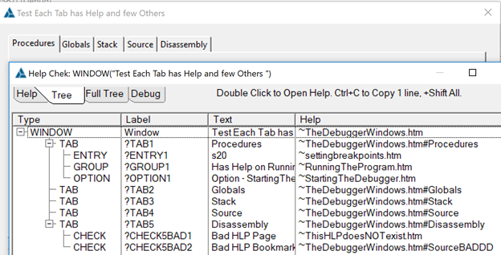

# CIDC 2017 HelpEngine Code

The CIDC download included these examples of using the Help Engine.

## CbHelpEngMsgBox Class - Show Message of HelpCmd

This simply shows a Message() with the Parameters passed to the HelpCmd method. It only does this for file extensions .MSGBOX so Help('xxxxMsgBox')

## CbHelpEngChek Class - Check Help IDs on a Window

Read the HelpChekInfo.pdf file for more info.

This engine has two features to assist your help author in knowing the Context string so he can edit or add the help. #1 When pressing F1 to open help it hooks that to call OutputDebugString with the HLP('~Context string'), then it opens the help using the required HLP or CHM engine. #2 Pressing Ctrl+Shift+F1 opens a Window showing all the Help for that window, many times Tabs will each have a topic.

## TestHelpChek1 Project

Simple project that tests the CbHelpEngMsgBox and CbHelpEngChek Classes.
